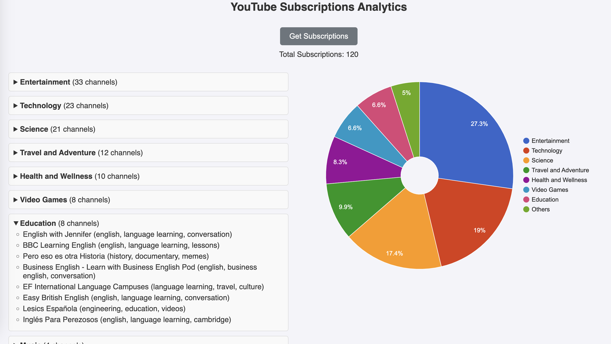
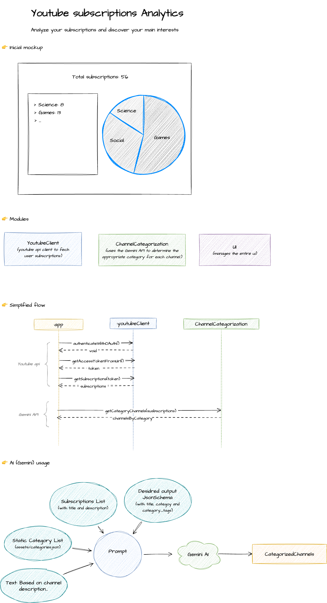

# YouTube Subscriptions Analyzer

## Description

**YouTube Subscriptions Analyzer** is a small pet project that leverages AI to analyze your YouTube subscriptions and detect your interests. By accessing your YouTube subscriptions through the Google API, the project categorizes your subscribed channels based on their descriptions using the **Gemini API**.

Built entirely with JavaScript, this project provides an engaging way to visualize your interests through interactive charts and a detailed breakdown of your subscriptions.

## Features

- **OAuth Authentication**: Securely sign in with your YouTube account using the OAuth implicit flow, eliminating the need for a backend server.
- **Subscription Analysis**: AI analyzes the descriptions of your subscriptions and categorizes the channels using the **Gemini API**.
- **Interest Visualization**: Displays an interactive chart showing the categories of your subscribed channels, making it easy to identify your primary interests.
- **Categorized Channel List**: Provides a detailed list of channels, grouped by category, with information about each one.
- **No Backend Required**: A webhook in **Make (Integromat)** is used to send requests to the **Gemini API**, removing the need for a backend infrastructure.

## How to Use

1. Clone the repository.
2. Install a simple HTTP server or use VSCode Live Server.
3. Open the `index.html` file in your browser.
4. Sign in with your YouTube account and let the project analyze your subscriptions.

## Technologies Used

- **Vanilla JavaScript**
- **Google OAuth 2.0 (Implicit Flow)**
- **YouTube Data API**
- **Google Charts**
- **Gemini API** (used for channel categorization, with a free tier available)
- **Make Webhook** (for requests to Gemini API, eliminating the need for a backend)

## Architecture

## Acknowledgements

- Part of the code for this project was written with assistance from **ChatGPT**. The AI was used thoughtfully to enhance the structure and quality of the code, while maintaining full developer oversight and control.
